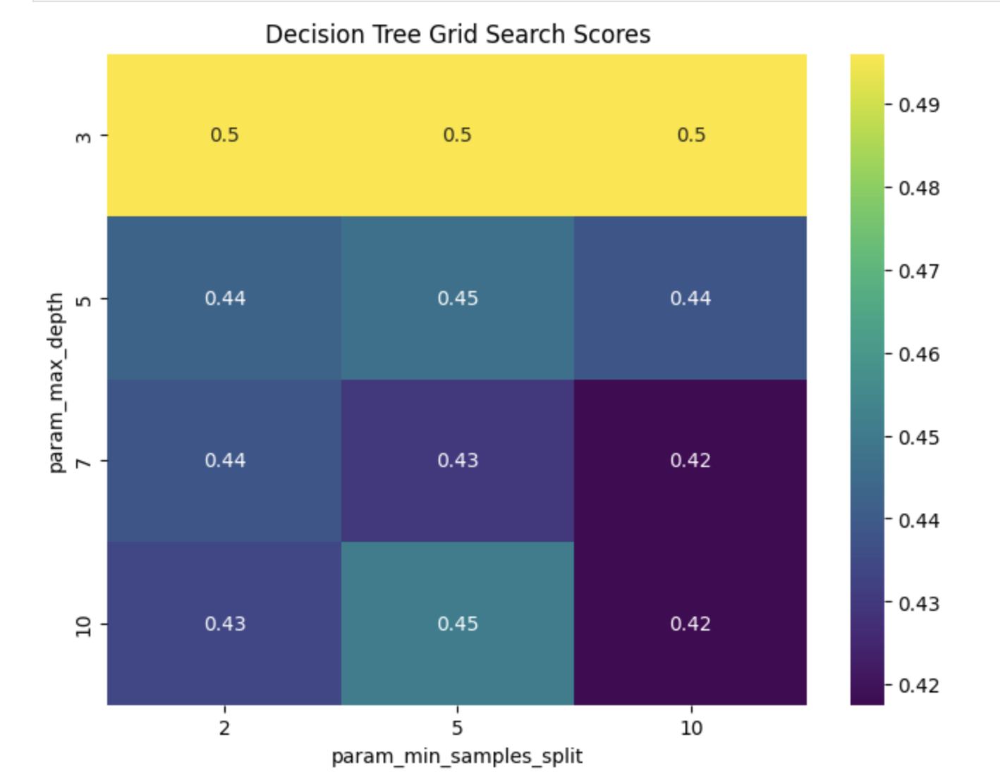

**Heart Disease Prediction: A Machine Learning Approach**

---

## **Introduction**
### **Problem Statement**
- **Objective**: Predict the presence of heart disease based on diagnostic measurements.
- **Dataset**: Heart Disease UCI dataset from the UCI Machine Learning Repository.
- **Significance**: Early detection allows timely medical intervention, potentially saving lives and reducing healthcare costs.

### **Cleveland Dataset Synopsis**
The **Cleveland dataset** is a subset of the **Heart Disease UCI dataset**, widely used in machine learning and medical research to predict heart disease. It contains **303 patient records** with **14 attributes**, including demographic information, medical measurements, and diagnostic results.

#### **Key Attributes:**
- **Demographic Factors**: Age, sex
- **Symptoms & Clinical Measurements**:
    - Chest pain type (4 categories)
    - Resting blood pressure (mm Hg)
    - Serum cholesterol (mg/dL)
    - Fasting blood sugar (>120 mg/dL)
    - Resting ECG results
    - Maximum heart rate achieved
    - Exercise-induced angina
    - ST depression induced by exercise
    - Slope of the peak exercise ST segment
    - Number of major vessels (0–3) colored by fluoroscopy
    - Thalassemia test results (3 categories)
- **Target Variable**: Heart disease presence (0 = No disease, 1–4 = Varying severity)

#### **Significance of Cleveland Data**
- Considered **the most relevant subset** of the UCI dataset for heart disease prediction.
- Used as the **benchmark dataset** in medical AI research.
- Contains **structured and clinically relevant** features that help in early detection.

---

## **Methodology**
### **Data Preprocessing**
- Handled missing values using **mean imputation**.
- Split dataset into **training** and **testing** sets for robust model evaluation.

### **Feature Engineering**
- Selected relevant features: **age, sex, chest pain type, resting blood pressure, cholesterol levels, etc.**
- Utilized **correlation matrices** and **pair plots** to assess feature relationships.

### **Machine Learning Models**
- **Logistic Regression** – Simple and interpretable.
- **Decision Tree** – Optimized hyperparameters using **GridSearchCV** (`max_depth`, `min_samples_split`).
- **Random Forest** – Leveraged ensemble learning for improved accuracy.
- **Gradient Boosting** – Enhanced ability to handle complex data patterns.
- **Bagging Classifier** – Combined multiple models to reduce variance.
- **Support Vector Classifier (SVC)** – Optimized **C** and **gamma** with **GridSearchCV**.
- **K-Nearest Neighbors (KNN)** – Evaluated for simplicity and effectiveness.

---

## **Model Evaluation**
### **Performance Metrics**
- **Accuracy**: Overall correctness of predictions.
- **Precision**: Proportion of correctly identified positive cases.
- **Recall**: Ability to detect actual positive cases.
- **F1-Score**: Harmonic mean of precision and recall for balanced evaluation.

- 

### **Results Summary**
| Model | Accuracy | Precision | Recall | F1-Score |
|--------|----------|------------|--------|----------|
| Logistic Regression | 0.57 | 0.57 | 0.34 | 0.33 |
| Decision Tree | 0.54 | 0.64 | 0.33 | 0.27 |
| Random Forest | 0.52 | 0.46 | 0.28 | 0.26 |
| Gradient Boosting | 0.48 | 0.39 | 0.23 | 0.21 |
| Bagging | 0.56 | 0.39 | 0.35 | 0.36 |
| Support Vector Classifier | 0.48 | 0.90 | 0.20 | 0.13 |
| K-Nearest Neighbors | 0.44 | 0.31 | 0.19 | 0.14 |

---

## **Visualizations**
- **Heatmaps**:
    - **Decision Tree Grid Search Scores** – Visualized hyperparameter performance.
    - **SVC Grid Search Scores** – Identified optimal hyperparameter combinations.

---

## **Interpretation of Results**
- **Logistic Regression**: Moderate accuracy and precision, but low recall indicates missed cases.
- **Decision Tree**: Balances precision and recall, but prone to overfitting.
- **Random Forest**: Decent trade-off but lacks significant improvement over simpler models.
- **Gradient Boosting**: Lower performance, indicating limited suitability.
- **Bagging**: Balanced approach with reasonable accuracy and precision.
- **SVC**: High precision but extremely low recall, meaning many false negatives.
- **KNN**: Least effective among tested models.

---

## **Conclusion**
- **Best Performing Models**: Logistic Regression and Decision Tree showed relatively better performance.
- **Challenges**: Data imbalance and hyperparameter tuning complexities.
- **Future Improvements**:
    - Implement advanced techniques like **deep learning** and **feature selection**.
    - Explore ensemble methods for enhanced prediction accuracy.

---

## **Key Insights from Data**
- **Age & Heart Disease**: Older age groups show higher prevalence.
- **Cholesterol Levels**: Elevated cholesterol increases risk.
- **Chest Pain Type**: Strong indicator of heart disease.
- **Resting Blood Pressure**: Higher values correlate with higher risk.
- **Maximum Heart Rate Achieved**: Lower rates indicate increased risk.
- **Exercise-Induced Angina**: Presence strongly suggests heart disease.

### **Impact**
These insights enhance understanding of risk factors, enabling better early diagnosis and treatment strategies for heart disease.

---
